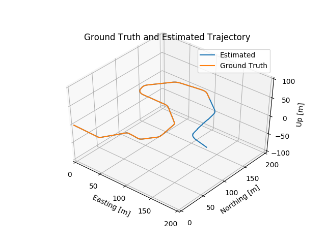
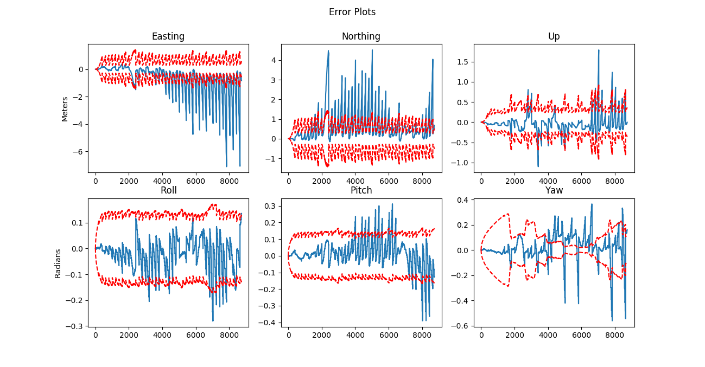
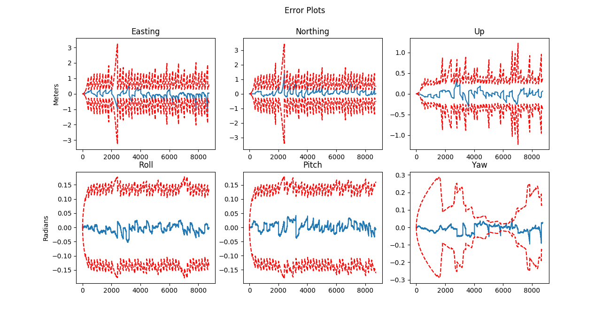
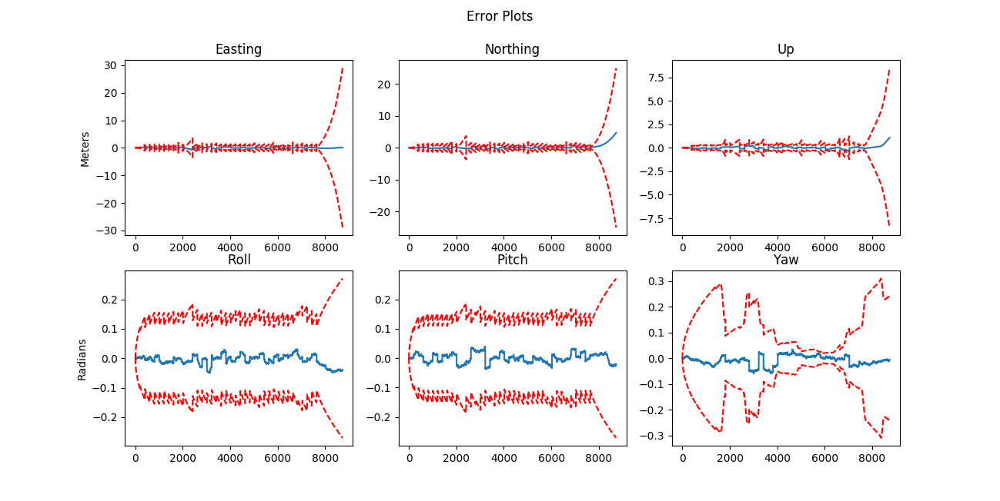

# State_Estimation
Implementation of an Error-State Extended Kalman Filter (ES-EKF) to localize a vehicle using data from the CARLA simulator.

## Table of contents
* [Multisensor Fusion](#multisensor-fusion)
* [Sensor Miscalibration](#sensor-miscalibration)
* [Sensor Dropout](#sensor-dropout)

## Multisensor Fusion
Sensor fusion combines the information from different sensors like cameras, IMUs, LIDAR, RADAR, GPS, etc. to estimate a single and best possible estimate of the vehicle state. To perform this, we can make use of the Extended Kalman Filter (EKF). In this case, we develop an Error-State EKF for estimating position, velocity and orientation using an IMU, GNSS sensor and LIDAR.

The filter prediction step relies on IMU data to propagate the state forward in time, and GPS and LIDAR position updates to correct the state estimate:

The filter implementation is tested by comparing the estimated vehicle position with the ground truth position, for a portion of the trajectory. Here is the output of the estimated trajectory:

## Sensor Miscalibration

Sensor calibration is really important in order to get accurate measurements and reduce errors in the estimates. A common problem is sensor miscalibration where one or more sensors are not calibrated correctly.

We will examine the effects of sensor miscalibration on the vehicle pose estimates, intentionally changing the transformation between the LIDAR sensor frame and the IMU sensor frame. Use of the incorrect transform will result in errors in the vehicle position estimate as we can see in the position stimate and error plots:

  

After looking at the errors, we need to adjust sensor noise variances. Concretely, we need to change the variance of the LIDAR measurements in the filter to a higher value as our uncertainty that LIDAR measurements are correct grows due to its incorrect calibration.
Here are the plots after making these changes:

  

## Sensor Dropout

Sensot Dropout is the loss or malfunction of one or more sensors for a period of time. This can happen for a number of different reasons, like weather damage, firmware failures, or entering a tunnel without GPS connection. 

In this project, we will explore the effects of sensor dropout, that is, when all external positioning information (from GPS and LIDAR) is lost for a short period of time.
To do this, we will load a different dataset where a portion of the GPS and LIDAR measurements are missing.

To illustrate this, we again can take a look at the position and error plots:

  

In this case, we should increase both LIDAR and GNSS variances in order to account for these errors.

## Refence
* This is the final project from the course [State Estimation and Localization for Self-Driving Cars](https://www.coursera.org/learn/state-estimation-localization-self-driving-cars?) from the University of Toronto.
